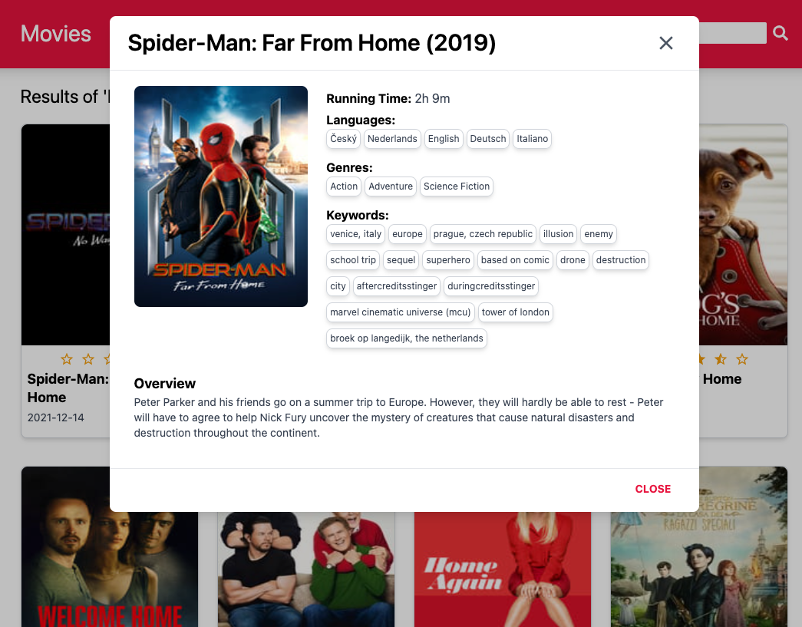

# React with GraphQL

This project is for searching movies by keyword.

## Environment

- React
- GraphQL (Apollo Client)
- Endpoint: https://tmdb.apps.quintero.io/

## Installing

```shell
$ git clone https://github.com/hyewondev/tvo-movie.git

$ cd tvo-movie

$ npm install

$ npm start
```

## Screens
https://hyewondev.github.io/movie/


